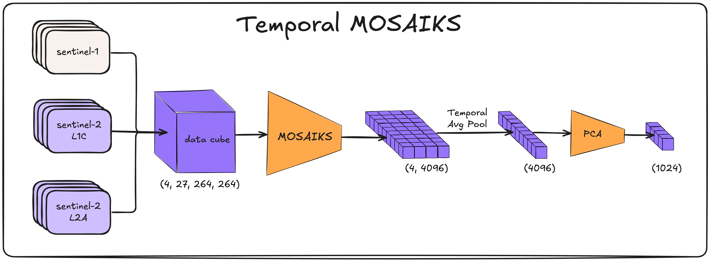

# Temporal MOSAIKS - Embed2Scale Challenge 4th Place Solution (Training Free!)

     

This repo contains the code for the 4th place solution to the [Embed2Scale Challenge](https://eval.ai/web/challenges/challenge-page/2465/overview) for the [2025 CVPR Earthvision Workshop](https://www.grss-ieee.org/events/earthvision-2025/).

## Team AI4G Intern Squad

- Isaac Corley ([@isaaccorley](https://github.com/isaaccorley)) - Wherobots
- Burak Ekim ([@burakekim](https://github.com/burakekim)) - University of the Bundeswehr Munich
- Caleb Robinson ([@calebrob6](https://github.com/calebrob6)) - Microsoft AI for Good Lab
- Esther Rolf ([@estherrolf]()) - University of Colorado Boulder

## Solution

Our goal for this challenge was to discover a compute-friendly method which can provide remote sensing image embeddings with adequate representations for downstream tasks **without any form of training or pretraining necessary.**

1) First we stack the Sentinel-1 and Sentinel-2 imagery across the channel dimensions creating a datacube of size `(4, 27, 264, 264)`.

2) We then feed this to MOSAIKS which is initialized using 4,096 randomly sampled 3x3 kernels from the dataset which generates a time-series of vectors of shape `(4, 4096)`.

3) We then perform mean pooling across the temporal dimension to reduce this to a single vector of shape `(4096)`.

4) To reduce this down to the required 1,204 dimensional vector we use simple PCA dimensionality reduction.
